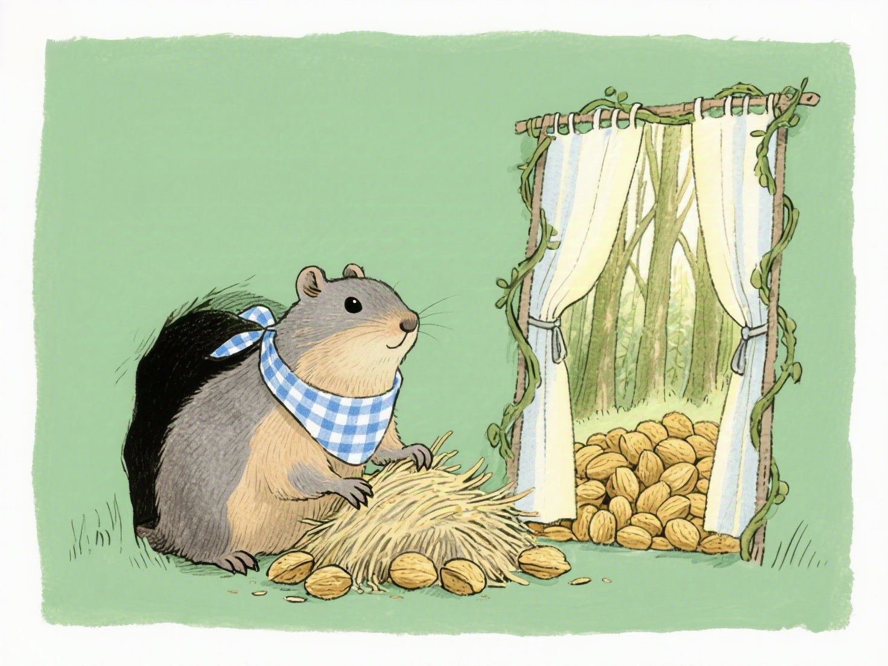
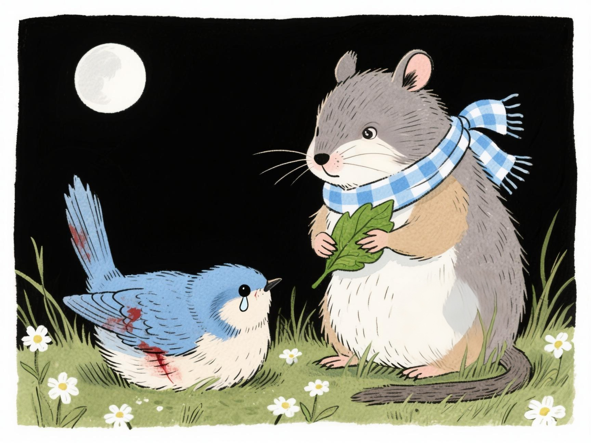
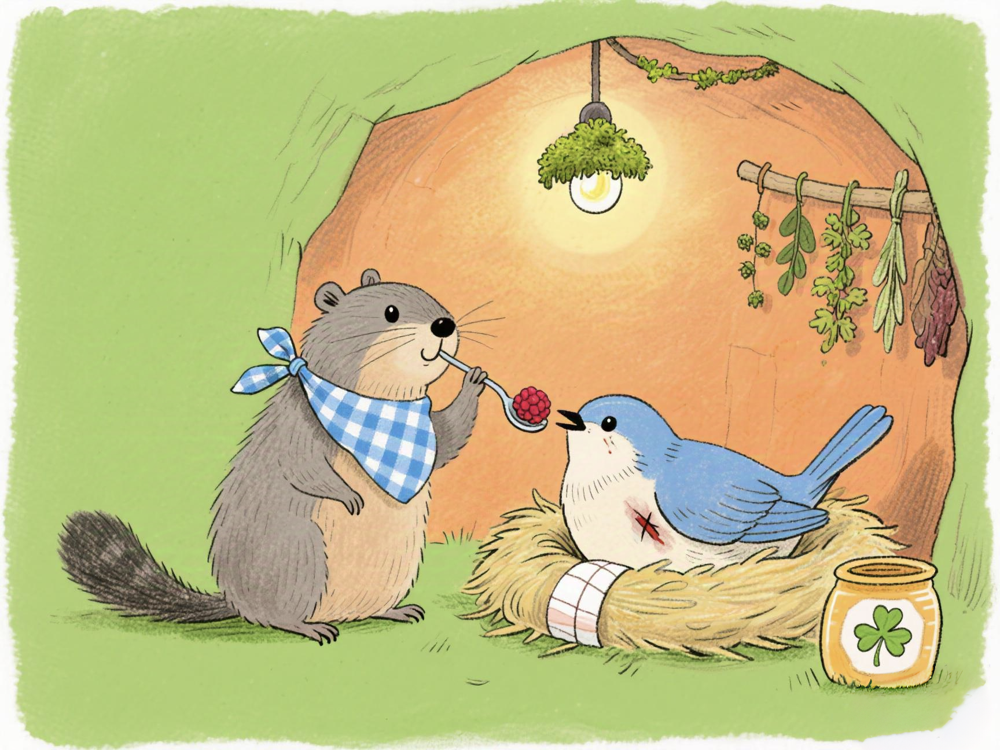
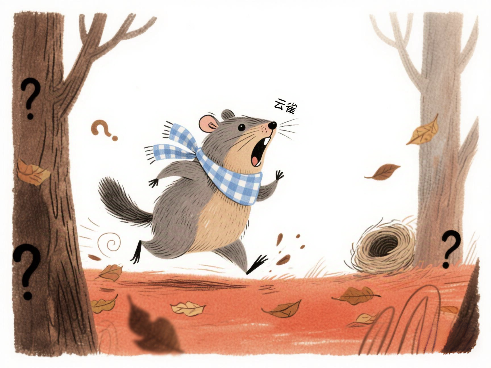
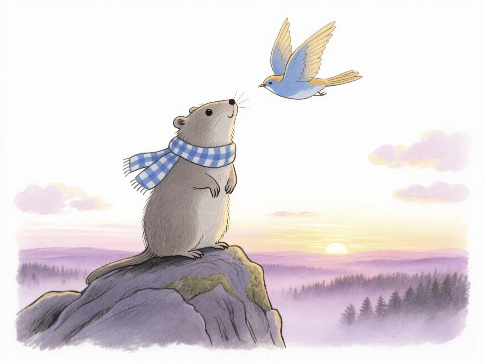
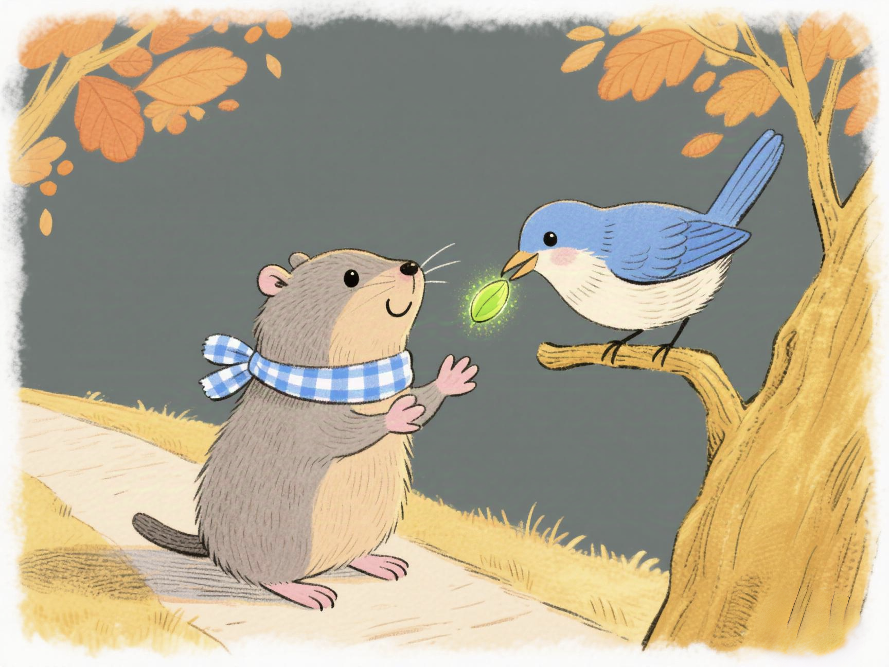
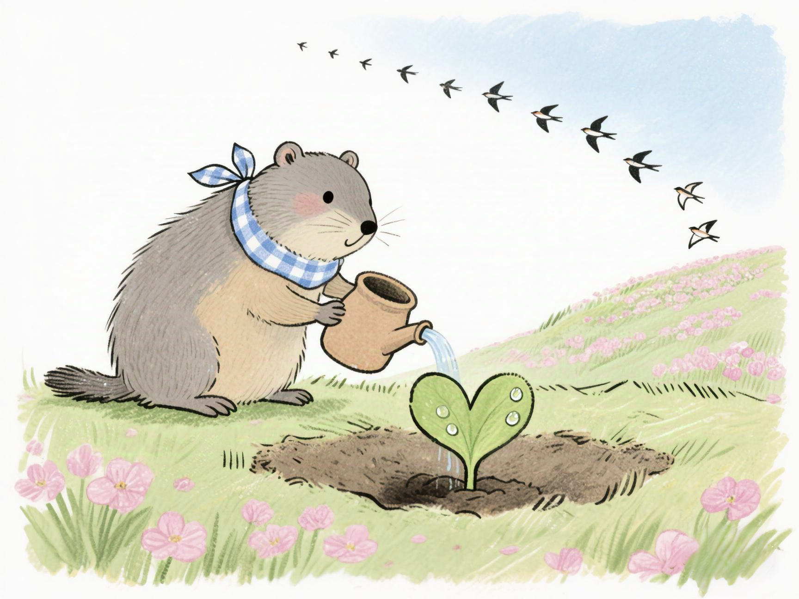
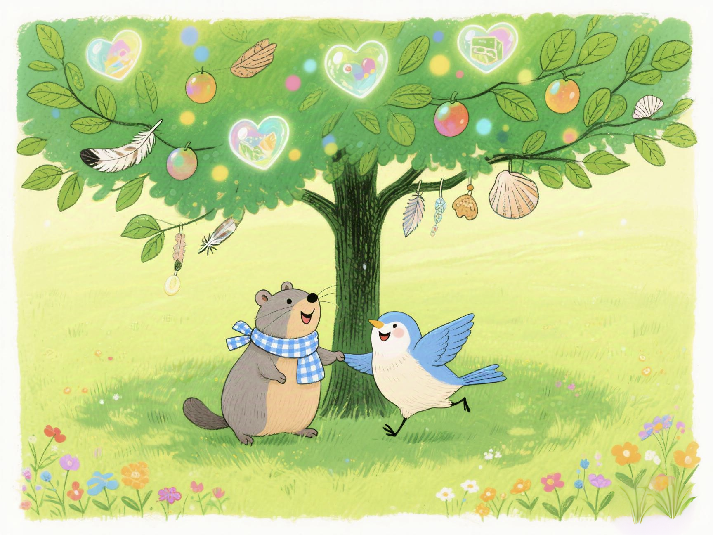

# 土拨鼠的守候

在一片幽深茂密的原始森林中，阳光只能透过层层叠叠的树叶，洒下星星点点的光斑。这里住着一只土拨鼠，名叫毛毛。它有着圆滚滚的身子，灰褐色的皮毛，还有那黝黑发亮的小眼睛。毛毛的家是一个舒适的小洞穴，洞内堆满了坚果，那是它辛苦囤积的过冬粮食。

一天傍晚，毛毛吃完饭，正准备美美地睡一觉，突然听到洞外传来一阵奇怪的动静。“是谁呢？”毛毛好奇地探出脑袋，四处张望。月光下，它发现不远处的草丛里有东西在微微挪动。毛毛小心翼翼地靠近，想看个究竟。

原来是一只受伤的小鸟，它的翅膀流着血，羽毛凌乱不堪，眼睛里满是惊恐和无助。毛毛立刻心生怜悯，赶忙跑回家，用嘴巴叼出一把备用的坚果，又拿来几片树叶，小心翼翼地为小鸟包扎伤口。在毛毛的悉心照料下，小鸟的伤势渐渐好转。

“你好，我叫毛毛。你叫什么名字呀？”毛毛轻声问道。

小鸟虚弱地回答：“我叫云雀。”

夜深了，毛毛和云雀紧紧依偎在一起，互相取暖，它们在月光下许下了一个温暖的约定：“等你好了，我带你去山顶看日出。”

就这样，毛毛每天都会出去找食物喂云雀，还会找来柔软的草叶为它筑巢。看到云雀一天天恢复，毛毛打心底里高兴。

一天午后，阳光正好，毛毛出去找食物，回来却发现云雀不见了，只留下一个空空的巢。它急得像热锅上的蚂蚁，在洞口转来转去，大声呼喊着云雀的名字，可怎么也找不到。

“云雀，你去哪儿了？”毛毛伤心地坐在洞口，望着远方。

它开始在森林里四处寻找，每一片树叶下，每一个树洞里，都留下了它的身影。可它找了整整一天，也没有找到云雀。最后，毛毛累得瘫坐在地上，满心失望。

就在这时，云雀突然从树梢飞了下来，落在毛毛的头顶上，欢快地叫着：“哈哈，我在这儿呢！”

原来，云雀趁毛毛出去找食物的时候，偷偷地飞到树枝上，想给毛毛一个惊喜。云雀调皮地眨眨眼，说：“我现在已经好了，我们一起去看日出吧！”

毛毛又惊又喜，一下子跳了起来，抱住云雀，激动地说：“你可把我吓坏了！”

于是，在一个清晨，太阳还没露出脸的时候，毛毛和云雀就来到了山顶。它们侧耳倾听，等待着第一缕阳光的到来。不一会儿，太阳慢慢地从地平线上升起，洒出万丈光芒，整个世界都被染成了金色。

“哇，太美了！”云雀兴奋地叫着，展翅飞向天空。

毛毛站在山顶，望着云雀的身影，心中充满了温暖。它们就这样在山顶待了一整天，直到夜幕降临。

在回去的路上，云雀突然停在了一棵树上，从嘴里吐出了一颗种子，轻轻放在毛毛的爪子上，说：“这是我给你的礼物，希望你种下它，让我们的友谊之树常青。”

毛毛接过种子，高兴地说：“谢谢你，我会好好照顾它的。”

云雀飞回南方过冬前，和毛毛紧紧拥抱在一起，约定来年春天再相见。

春天到了，毛毛带着精心呵护的种子来到山顶，在云雀曾经停留过的地方种下。它每天都会来给种子浇水、施肥，小心翼翼地照顾着它。

终于有一天，种子发芽了，嫩绿的小芽破土而出，像一个小精灵在向毛毛招手。毛毛高兴极了，它知道这是它和云雀友谊的见证。

日子一天天过去，小芽渐渐长成了一棵茁壮的小树。有一天，当阳光正好时，小树上出现了一个熟悉的身影，那是云雀！它从南方回来了，遵守着和毛毛的约定。

云雀飞到毛毛的肩膀上，轻轻啄着它的耳朵，说：“我回来啦！”

毛毛开心地手舞足蹈，说：“我也在等你呢！看，我们的友谊之树已经长出来了。”

两只小动物在树下嬉戏打闹，笑声回荡在山谷中。

从那以后，云雀每年都会回来，和毛毛一起在友谊之树下玩耍，而这棵树也越长越高，枝繁叶茂。

毛毛明白了，无论遇到什么困难，只要心中有温暖，有爱，就能战胜一切。它和云雀的友谊，就像那棵友谊之树，永远枝繁叶茂，长盛不衰。而它们也在这片森林中，过着幸福快乐的生活，直到永远。