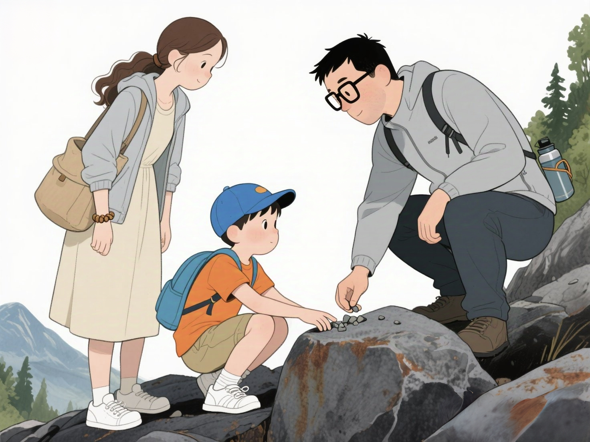
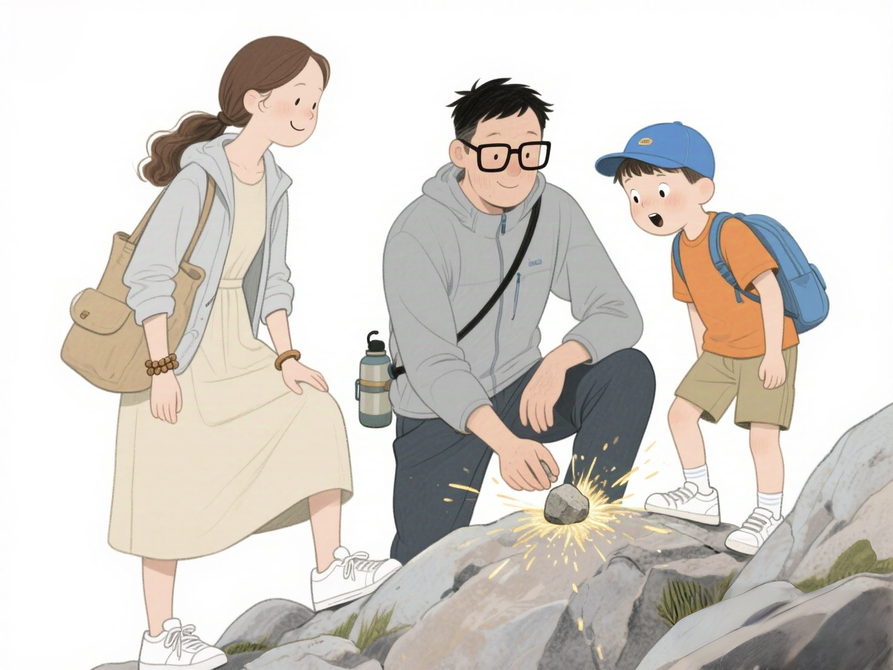
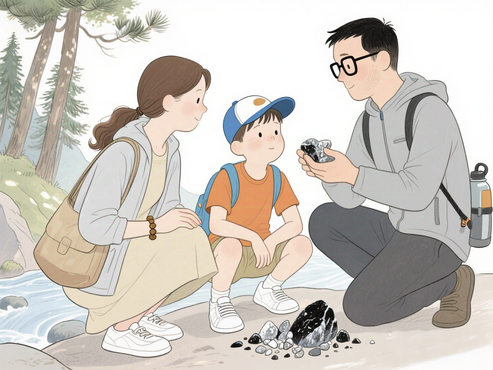
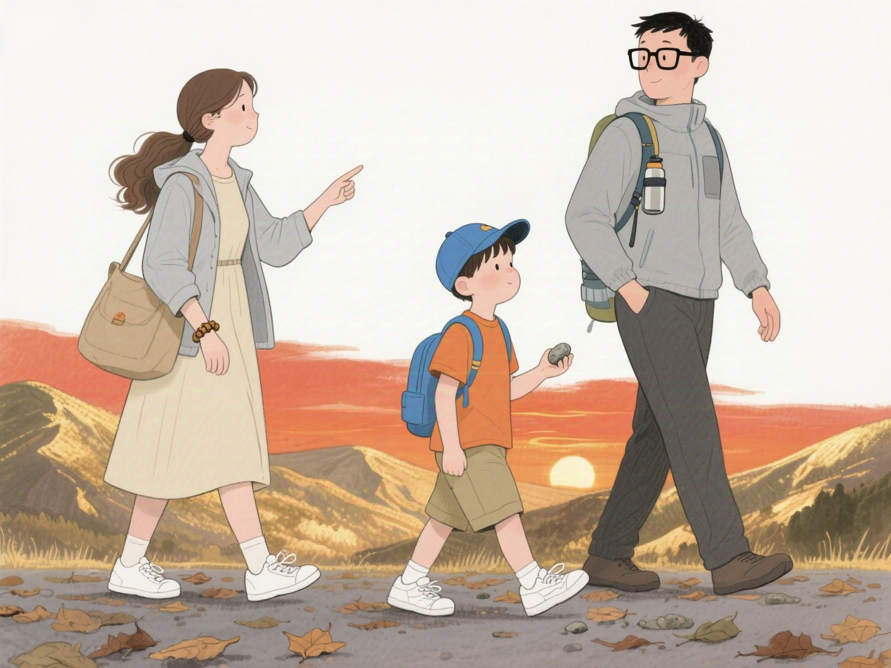

# 封印在石头里面的火精灵

> 小朋友你好呀，你有没有想过，石头里面到底藏着什么秘密？为什么两块石头碰撞时会冒出小火花？难道石头里真的住着调皮的小精灵，还是有别的神奇原因呢？带着这些好奇，让我们一起走进今天的故事，去揭开石头里的奥秘吧！

在一个阳光明媚的周末早晨，八岁的明明背上了他最喜欢的小背包，和爸爸妈妈一起踏上了去郊外爬山的旅程。山间的空气清新，鸟儿在枝头欢快地歌唱，微风轻轻拂过脸颊，带来阵阵花草的香气。明明一路上蹦蹦跳跳，时而停下来观察路边的小虫子，时而捡起一片形状特别的树叶，对大自然的一切都充满了好奇和惊喜。

爬到半山腰时，明明被一块形状奇特的石头吸引了。这块石头黑溜溜的，表面有些粗糙，但又隐隐闪烁着一丝光泽，像是藏着什么神秘的东西。明明走上前，蹲下身子，伸手轻轻抚摸着石头，自言自语道：“小石头，你里面到底藏着什么呢？是宝石吗？还是有小精灵住在里面呀？”

爸爸笑着走过来，蹲在明明旁边：“明明，石头里面其实藏着很多秘密呢！不过不是宝石或者小精灵哦。石头是由各种各样的矿物质组成的，就像我们的身体是由不同的器官和组织构成一样。不同的石头，里面的矿物质成分不一样。”

“哇，爸爸，那这些矿物质都是什么呢？” 明明的眼睛瞪得圆圆的，满是好奇。

爸爸捡起一块小碎石，轻轻敲了敲那块大石头，瞬间，一个小火花闪了一下。“明明，你看，石头相互碰撞会产生火花的哦。”

明明惊讶得张大了嘴巴：“哇，爸爸你好厉害，怎么会有火花呢？”

爸爸耐心地解释道：“这是因为有些石头里面含有铁质成分，就像我们常见的铁块一样。当两块含有铁质的石头相互碰撞时，石头表面的铁质会被摩擦掉一小部分，变成很细小的颗粒。这些颗粒在摩擦产生的高温下，会迅速和空气中的氧气发生反应，也就是被氧化了，这个过程就会释放出能量，形成我们看到的火花。”

明明似懂非懂地点点头，但他又提出了新的疑问：“爸爸，那是不是所有的石头碰撞都会产生火花呢？”

爸爸摇摇头：“不是的，只有含有铁质等特定成分的石头碰撞才有可能产生火花。比如我们常见的花岗岩、砂岩这些石头，它们里面铁质含量相对较低，碰撞时就不容易产生明显的火花。”

这时，妈妈也走了过来，微笑着说道：“明明，大自然就像一个神奇的宝藏，里面藏着无数的秘密等待我们去探索。而你们每一个小小的疑问，都是打开这些宝藏的钥匙哦。”

明明若有所思地点点头，他把那块奇特的石头小心翼翼地放进背包，仿佛它是开启大自然奥秘的珍贵钥匙。

在回家的路上，明明一直在想着石头里面那些神奇的矿物质，想着石头碰撞产生火花的奇妙过程。他的心里种下了一颗探索科学的种子，相信在未来的日子里，这颗种子会在他不断的好奇与求知中生根发芽，茁壮成长，让他在探索自然奥秘的道路上越走越远。

> 好了，小朋友今天的故事就讲到这里了，你是不是也对大自然充满了好奇呢？其实，科学的奥秘就藏在我们身边的每一个小细节里。只要你愿意多观察、多思考、多提问，说不定下一个发现大自然秘密的小小科学家，就是你哦！  
>  
> 记得带着好奇心，去探索世界吧！我们下次故事再见~
