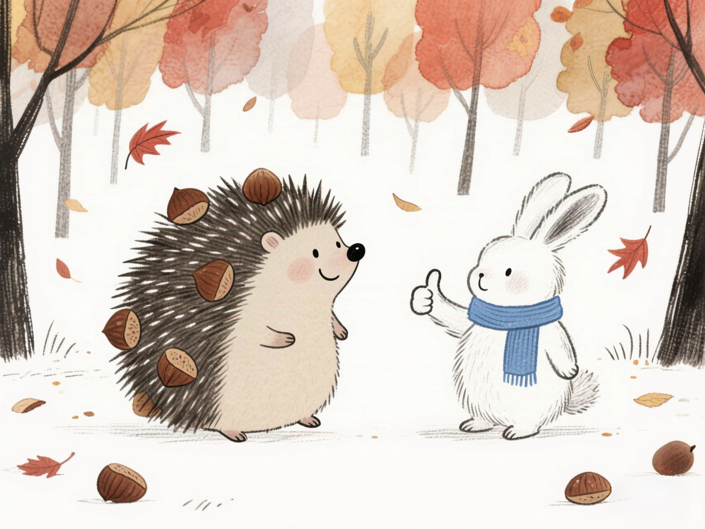

# 小刺猬的金色果实

小朋友你好呀，我是大家都喜欢的大头强啊，最近森林里发生的一件十分有趣的故事，快来让我给你讲一讲吧，这个故事的名字叫《小刺猬的金色果实》。

秋天的森林好像被打翻的颜料罐，枫叶像火一样红艳，银杏叶像阳光一样金灿灿的。一阵风吹过，仿佛下起了一场蝴蝶雨。小刺猬果果蹲坐在栗子树下，它背上的尖刺已经挂满了圆滚滚的栗子，就像一座会移动的小山丘一样。

“果果真棒！”路过的兔子朵朵竖起长耳朵夸赞着，“你收集果实的本领，就连松鼠阿松都比不了呢！”果果害羞地缩了缩脖子，鼻尖还沾着栗子壳的绒毛。她最喜欢秋天了，因为她背上的尖刺就是最好的“篮子”，能帮她收集整个森林的甜蜜果实——有酸甜的山楂、香香的橡果，还有枝头沉甸甸的柿子。

可是有天傍晚，果果在钻灌木丛的时候，一根生锈的铁丝勾住了她背上的刺。“嘶——”她疼得眼泪打转，背上的栗子噼里啪啦掉了一地，好几根尖刺也歪歪扭扭地耷拉下来。“怎么办呀？”果果抱着剩下的几颗栗子坐在石头上，看着地上枯黄的树叶，心里像被霜打了的浆果一样苦涩。没有尖刺，“我还怎么准备冬天的粮食呢？”

第二天清晨，果果听见窗外有轻轻的敲门声。打开木门，看见朵朵抱着一篮山楂，阿松举着一串晒干的蘑菇，就连平时总把尾巴翘得高高的狐狸阿狸，也叼着几串红彤彤的柿子站在门口。“我们帮你呀！”朵朵的长耳朵蹭了蹭果果的鼻尖，“你看，阿松的爪子能爬树，阿狸的尾巴能打扫落叶帮你找到地上的果实，我的菜篮子能装好多果实呢！”

于是，森林里出现了一支特别的队伍。果果走在中间，朵朵用篮子提着捡来的橡果，阿松像个小皮球似的在树杈间来回蹦跳，把摘下来的柿子轻轻的放在菜篮子里，朋友们用树叶和藤蔓编了个小背篓，稳稳地兜住了果实。阿狸则甩着蓬松的尾巴，把躲在落叶下的栗子扫成一堆，果果只要轻轻一滚，就能把栗子藏进毛茸茸的肚皮底下。

他们从东边的山楂林走到西边的胡桃坡，阳光穿过树叶的缝隙，在果果的背上洒下斑驳的金点。当最后一颗柿子放进藤编的小背篓时，果果感受到了朋友们带给她的温暖，是背上任何尖刺都比不了的。

第一场雪落下来的时候，果果的小木屋里堆满了小山似的粮食。朋友们围坐在炉火旁，朵朵把山楂熬成甜甜的果酱，阿松用蘑菇炖了香香的汤，果果把烤好的栗子分给大家，就连阿狸也带来了晒干的玫瑰花瓣，泡出的茶让整个屋子都飘着花香。

“其实没有尖刺也没关系呀。”果果看着朋友们被火炉映红的笑脸，突然发现自己的心里长出了比尖刺更坚硬的东西——那是朋友们手拉手围成的圆圈，是分享时暖融融的心跳，即使冬天再漫长，也不会害怕的勇气。

窗外的雪花还在轻轻的飘落，小刺猬的尖刺慢慢长好了，但她知道，比起用刺背回的果实，那些和朋友一起收集果实的日子，才是藏在心底最珍贵的宝藏。

好了，小朋友今天的故事就讲到这里了，希望你也能和果果一起，在秋天的森林里，用自己的手和朋友一起收集美味的果实，让秋天的果实，带给你最美好的回忆。