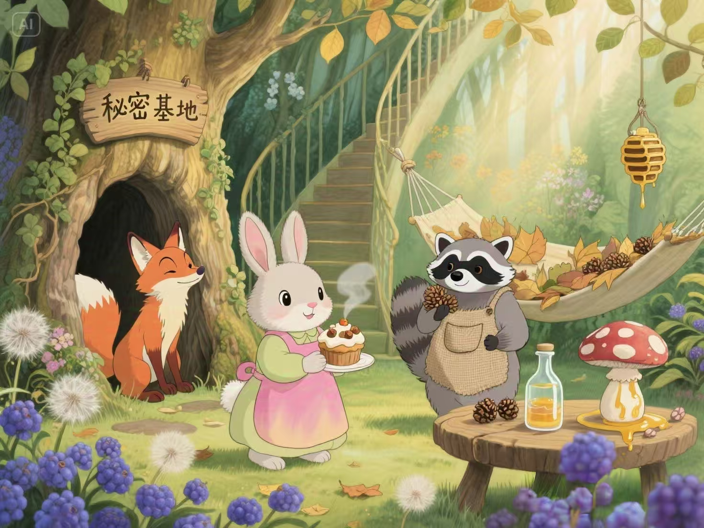
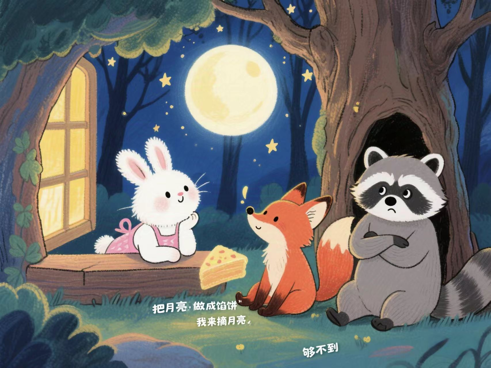
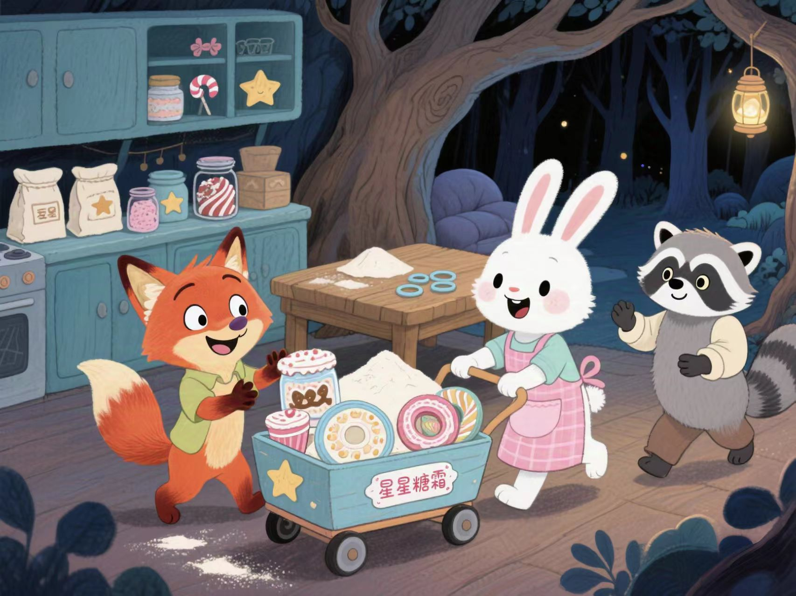
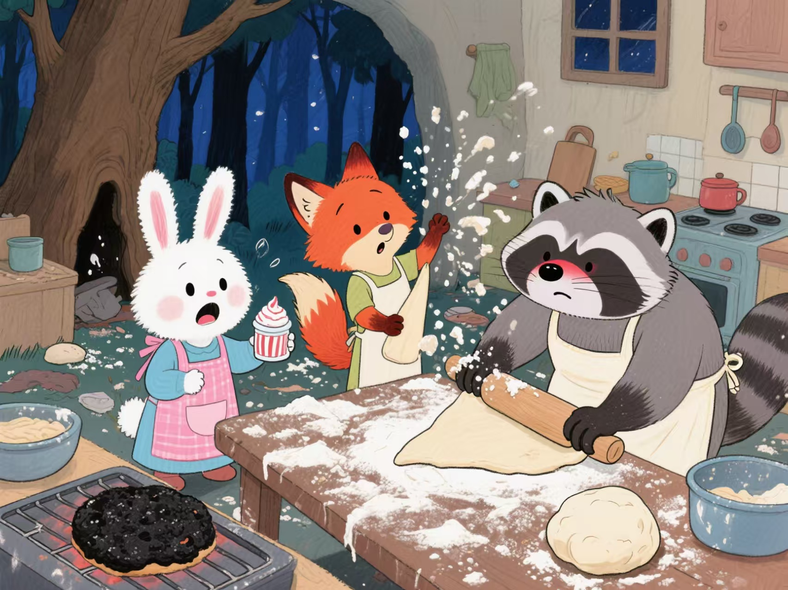
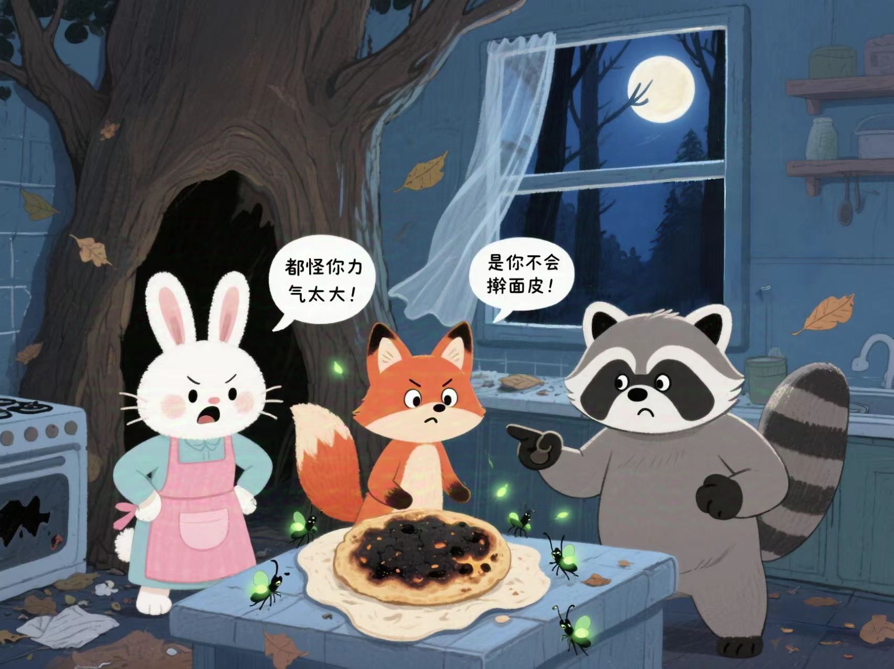
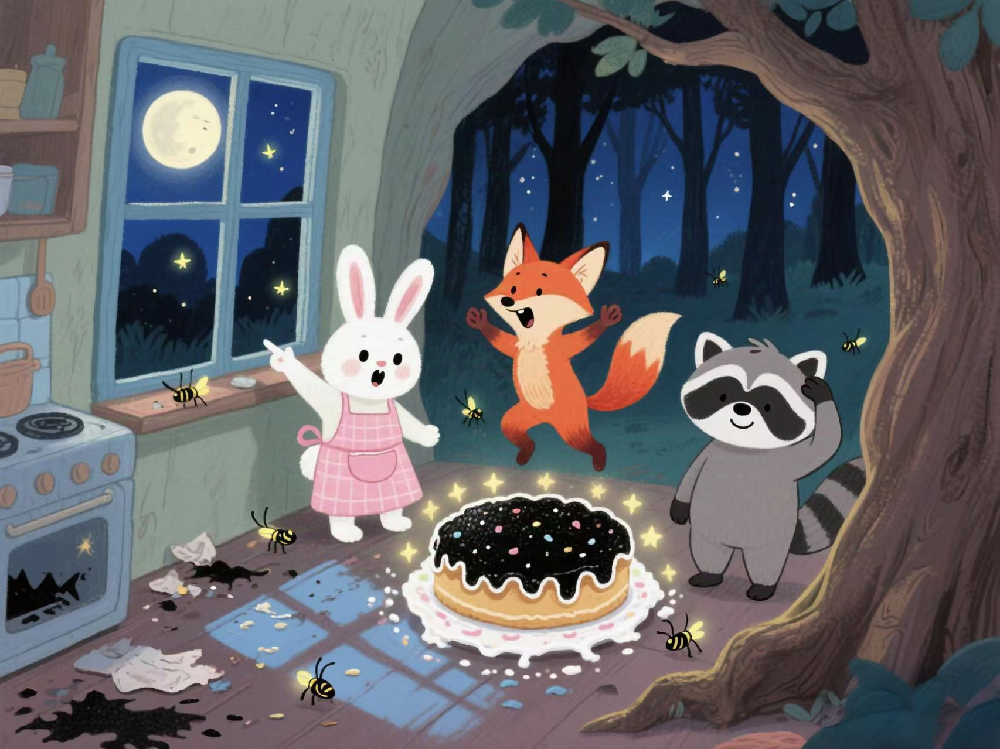
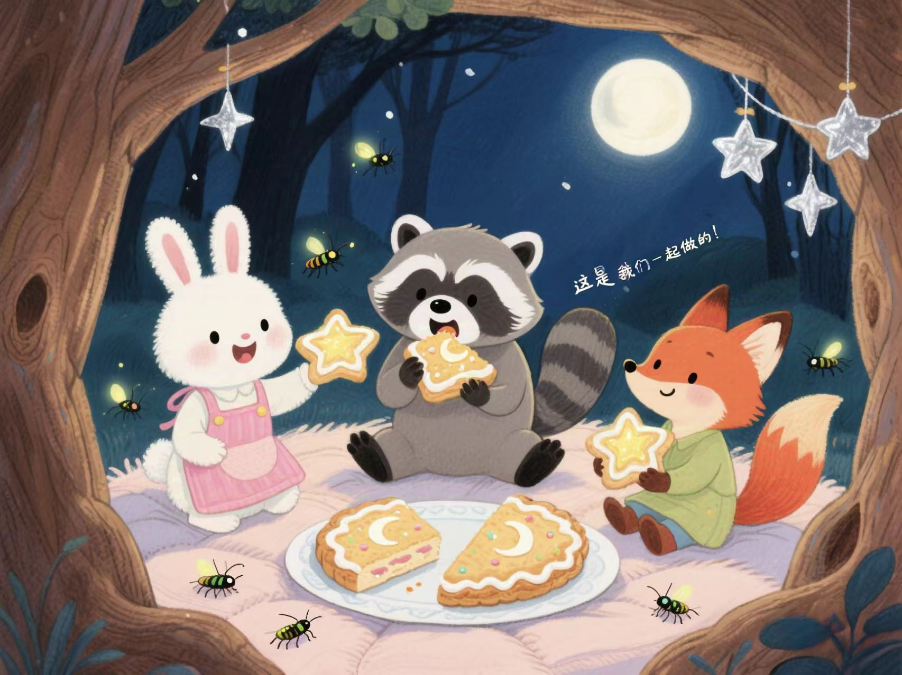
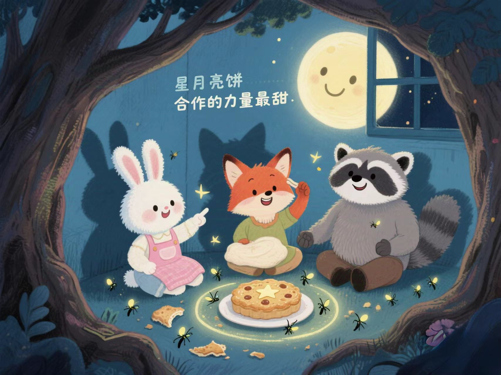
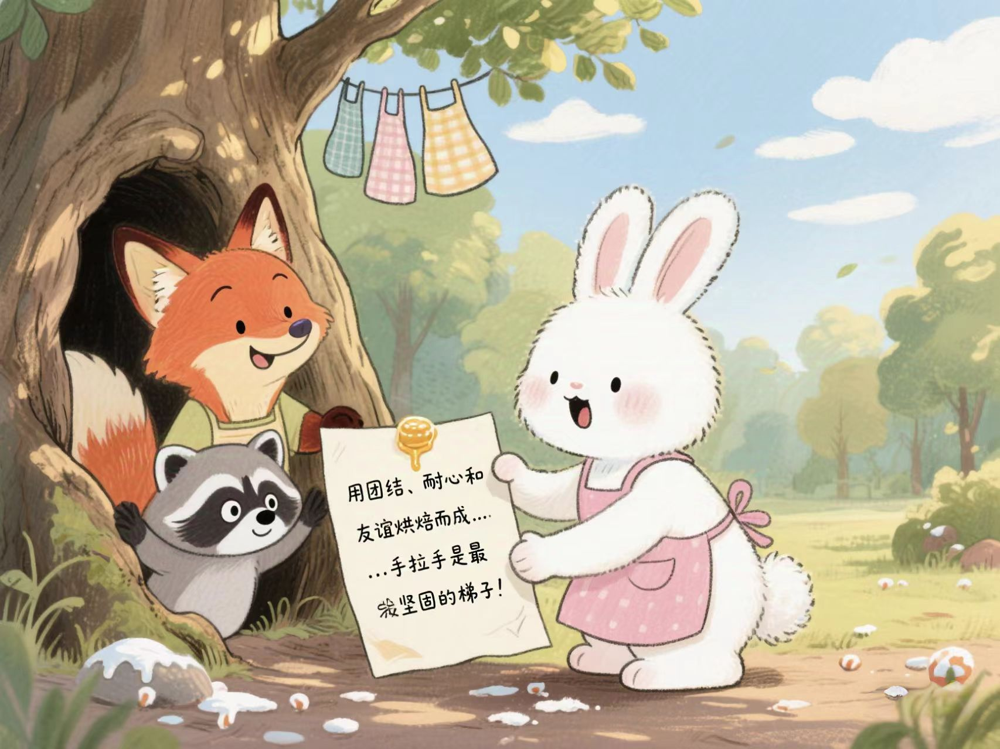

# 月亮馅饼的秘密

森林里住着三只可爱的小动物：总爱做甜点的小兔子绒绒、擅长爬树的小狐狸豆豆，还有力气最大的小浣熊壮壮。他们住在同一棵大橡树下，树洞里藏着大家共同的秘密基地。

这天是满月夜，绒绒趴在窗边看月亮，突然说："要是能把月亮做成馅饼该多好呀！金灿灿的，肯定比蜂蜜还甜。"豆豆立刻竖起耳朵："我来摘月亮！"壮壮却摇摇头："月亮在天上，我们够不到的。

""我有办法！"绒绒从厨房推出小推车，里面堆满面粉、糖霜和模具，"我们可以用面团做个月亮饼，再撒上星星糖霜！"豆豆和壮壮眼睛亮晶晶的，立刻加入进来。

可麻烦事接踵而至：壮壮揉面时力气太大，面团粘得到处都是；豆豆负责擀面皮，结果把面皮擀成了歪歪扭扭的三角形；绒绒撒糖霜时手一抖，糖霜像雪花一样洒了满地。

"都怪你力气太大！""是你不会擀面皮！""才不是，是糖霜太滑了！"三个小伙伴吵得面红耳赤，月亮饼变成了黑乎乎的"煤球"。这时，一阵夜风把"煤球饼"吹到了窗台上。

"快看！"绒绒突然指着窗外惊呼，煤球饼在月光下泛着微光，窗台上的萤火虫被吸引过来，围着"煤球"飞舞，像点缀了无数小星星。"这不就是我们的星星月亮饼吗？"豆豆跳起来。

壮壮挠挠头："虽然不像真的月亮，但这是我们三个一起做的，比什么都好！"他们把饼切成三份，连萤火虫都分到一粒糖霜。吃饱后，三个小伙伴躺在树洞的软垫上，看着真正的月亮和满天的星星。

"原来合作的力量最甜呀。"绒绒小声说。月光透过树洞洒在他们身上，像盖了层银色的被子。

绒绒的话让豆豆和壮壮都点了点头。豆豆挠了挠耳朵说："对呀，要不是壮壮帮忙揉面，面团早就变成面糊了；要不是绒绒提醒我轻一点，面皮也不会破洞。"壮壮拍了拍胸脯："还有我，要不是你们教我慢慢来，我肯定又把面团砸到屋顶上去了！"

他们手拉着手围坐在星星月亮饼旁边，萤火虫在周围欢快地飞舞，像是撒满了会发光的糖霜。绒绒指着天上的月亮说："看，真正的月亮也在笑呢！它告诉我们，只要团结一心，再难的事情也能变得甜甜的。"

月光仿佛听懂了他们的话，变得更加柔和明亮，把整个树洞映得如同洒满了银色的蜂蜜。三个小伙伴依偎着进入了甜甜的梦乡，梦里还飘着星星月亮饼的香气。

第二天清晨，绒绒在树下发现了一个小纸条，上面用蜂蜜写着月亮的留言："亲爱的朋友们，昨晚的星星月亮饼是森林最甜的点心，因为它是用团结、耐心和友谊烘焙而成的。记得，当遇到困难时，手拉手就是最坚固的梯子！"

从此以后，每当遇到难题，三只小动物总会想起那晚的月亮饼和月亮的悄悄话。他们知道，只要心往一处想、劲往一处使，就没有摘不到的"星星"！
